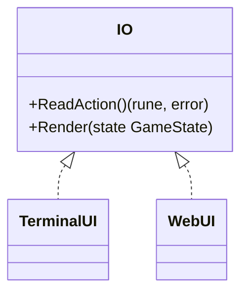
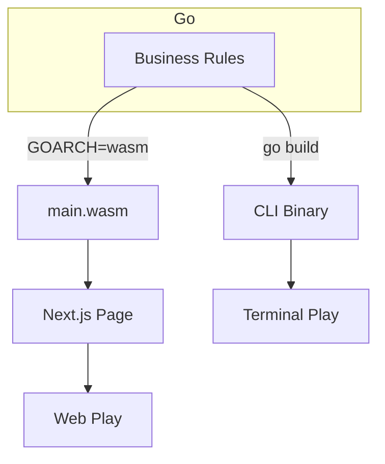
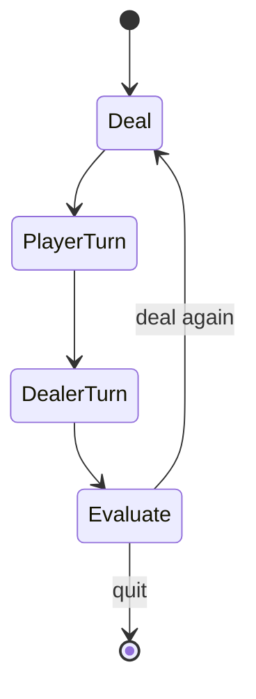

# Blackjack

A cross-platform blackjack engine written in Go. The core business rules are shared between a terminal-based user interface and a WebAssembly module that plugs into a Next.js front end. This lets one set of strongly typed, well-tested logic power both a CLI and an interactive web page.

## Running the game

### Terminal
1. Change into this directory:
   ```bash
   cd go/blackjack
   ```
2. Build or run directly:
   ```bash
   go run .            # quick play
   # or
   make build && ./blackjack
   ```
3. On Windows you can produce an `.exe` with:
   ```bash
   go build -o blackjack.exe
   ```

### Web via Next.js
1. Compile the Go code to WebAssembly:
   ```bash
   cd go/blackjack
   make wasm
   cp docs/main.wasm docs/wasm_exec.js ../../public/
   ```
   The helper `main.js` in `public/` bootstraps the WASM module.
   > Alternatively, compile directly without using the `Makefile`:
   > ```bash
   > GOOS=js GOARCH=wasm go build -o ../../public/main.wasm
   > ```
2. Launch the Next.js dev server from the repository root:
   ```bash
   npm install
   npm run dev
   ```
3. Open <http://localhost:3000/blackjack> in a browser to play.

### Visual Studio Code
The repository ships with a `.vscode/launch.json` that exposes two handy run targets:
- **Launch BlackJack** – debug the terminal version (press `F5`).
- **Build Blackjack Wasm** – compile `main.wasm` straight into the `public/` folder.

## Technologies
- **Go 1.19** – core language for rules and game engine.
- **WebAssembly** – enables the Go engine to execute in the browser.
- **Next.js 15 / React / TypeScript** – host the web UI.
- **`github.com/mattn/go-tty`** – tiny dependency for terminal input.

The Go module is intentionally small:
```go
module blackjack

go 1.19

require github.com/mattn/go-tty v0.0.4 // direct

require (
        github.com/mattn/go-isatty v0.0.14 // indirect
        golang.org/x/sys v0.0.0-20220422013727-9388b58f7150 // indirect
        gopkg.in/yaml.v2 v2.4.0
)
```

## UI abstraction
The engine does not talk directly to any UI. Instead it defines a tiny interface and two implementations:

```go
type IO interface {
    ReadAction() (rune, error)
    Render(state GameState)
}
```



This separation means the same bullet‑proof rules (`cards`, `dealer`, `rules`, etc.) drive both the CLI and WASM builds. Only the view layer changes.

## Why Go → WASM?
- **Single source of truth.** Validators and gameplay rules live once in Go and are reused across CLI, server, and browser.
- **Deterministic, CPU‑friendly kernels.** Compiled Go can outperform ad‑hoc JS for number‑crunching tasks like shuffle logic or side‑bet math.
- **Portability.** The generated `main.wasm` can be integrity‑pinned and served from any static host.
- **Memory safety & types.** Go’s type system and WASM’s bounds‑checked memory eliminate whole classes of bugs.
- **Efficiency.** Compiled Go can outperform plain JavaScript for CPU‑bound tasks like scoring or strategy hints.
- **Offline logic.** The browser can execute complex rules without round‑trips to a server.

These same advantages translate to EHR work: FHIR parsers, rules engines, or de‑identification routines can run unchanged on the server, in a CLI tool, or directly in a browser for air‑gapped environments.

## Example flow


## Game flow


## Testing
Run the Go unit tests from this directory:
```bash
go test ./...
```
