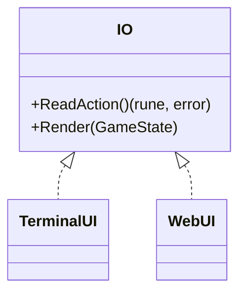
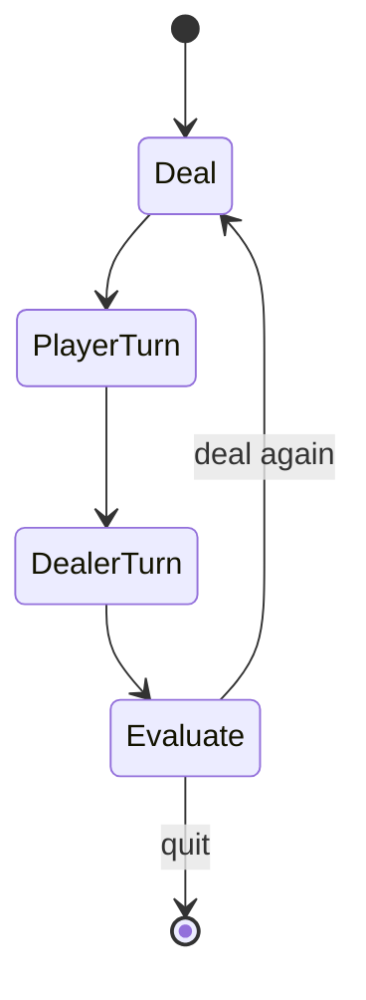

# Blackjack

A Go-powered blackjack engine with one set of business rules that runs on the command line and in the browser.  The core logic is written once in Go and either executed directly or compiled to WebAssembly so that a Next.js front end can load the same code.

## Run It Your Way

### Web (Next.js + WebAssembly)
1. Compile the game to Wasm so the browser can load it:
   ```bash
   cd go/blackjack
   GOOS=js GOARCH=wasm go build -o ../../public/main.wasm
   ```
2. Launch the Next.js app from the repository root:
   ```bash
   npm run dev
   ```
3. Open [http://localhost:3000/blackjack](http://localhost:3000/blackjack) to play in the browser.

### Terminal (Go CLI)
```bash
cd go/blackjack
# run directly
go run .
# or build an executable
go build -o blackjack
./blackjack
```

### VS Code
` .vscode/launch.json ` ships debug tasks for both environments.  Use **Launch BlackJack** to run the CLI with flags or **Build Blackjack Wasm** to emit `public/main.wasm` straight from the editor.

## Technologies
- **Go 1.19** with a tiny module file and only one direct dependency.
- **WebAssembly** to bring the Go engine into the browser.
- **Next.js 15** for the React UI and asset pipeline.

The minimal `go.mod` highlights how few third‑party packages are required:
```go
module blackjack

go 1.19

require github.com/mattn/go-tty v0.0.4 // direct

require (
    github.com/mattn/go-isatty v0.0.14 // indirect
    golang.org/x/sys v0.0.0-20220422013727-9388b58f7150 // indirect
    gopkg.in/yaml.v2 v2.4.0
)
```

## Architecture – Shared Rules, Pluggable UI
The `ui.IO` interface isolates rendering and input so the same engine works in both environments.

```go
type IO interface {
    ReadAction() (rune, error)
    Render(GameState)
}
```

#### Class Diagram


## Game Flow


## Why Go→Wasm?
- **Single source of truth** – the same validated rules run in CLI, server and browser.
- **Deterministic, typed logic** – Go's type system and Wasm's memory safety reduce an entire class of bugs.
- **Portability** – ship one `main.wasm` artifact and reuse it across workers, browsers or edge runtimes.
- **Efficiency** – compiled Go can outperform plain JavaScript for CPU‑bound tasks like scoring or strategy hints.

## Relevance to EHR Projects
The pattern applies directly to health‑care apps.  Complex FHIR/HL7 parsers, patient‑permission checks or de‑identification routines can live in Go and be reused in terminal tooling, servers or secure client‑side Wasm modules—keeping sensitive logic consistent and testable everywhere.

## Testing
```bash
cd go/blackjack
go test ./...
```
